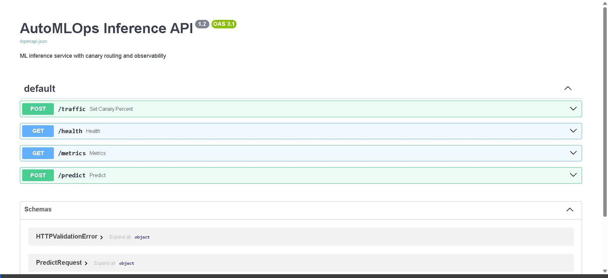
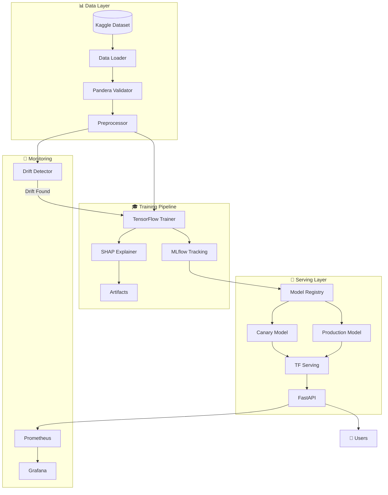

# 🚀 AutoMLOps — Production-Grade MLOps Pipeline

[](https://www.python.org/downloads/)
[](https://www.tensorflow.org/)
[](https://mlflow.org/)
[](https://fastapi.tiangolo.com/)
[](https://docs.docker.com/compose/)

## 🎥 Demo



> **Quick Start:** `docker compose up -d --build` then visit:
> - 📊 **MLflow:** http://localhost:5000
> - 🚀 **FastAPI:** http://localhost:8000/docs
> - 📈 **Grafana:** http://localhost:3000

---

## 🎯 What Makes This Special

| Feature | Description |
|---------|-------------|
| 🔥 **Real Dataset** | Credit Card Fraud Detection (284K transactions) |
| 🧠 **Model Explainability** | SHAP feature importance plots |
| ✅ **Data Validation** | Pandera schema enforcement |
| 📊 **56+ Unit Tests** | Comprehensive test coverage |
| 🎨 **Type Hints** | 100% typed Python codebase |
| 📝 **Google Docstrings** | Professional documentation |
| 🔄 **Canary Deployments** | Safe production rollouts |
| 📈 **Drift Detection** | Automatic model retraining |

---

## 🏗️ Architecture



---

## ✨ Features

### Core Pipeline
- **MLflow Tracking & Registry** — Experiment logging, model versioning, stage transitions
- **TensorFlow Serving** — High-throughput SavedModel inference
- **FastAPI** — Production REST API with validation and metrics
- **Canary Deployments** — Traffic splitting for safe rollouts

### Data & Quality
- **Real Fraud Dataset** — 284,807 transactions, 29 features
- **Pandera Validation** — Schema enforcement, missing value detection
- **Class Imbalance Handling** — Configurable undersampling

### ML Operations
- **SHAP Explainability** — Feature importance and summary plots
- **Data Drift Detection** — KS-test and PSI metrics
- **Auto-Retraining** — Triggered when drift exceeds thresholds
- **Model Cards** — Auto-generated documentation

### Observability
- **Prometheus Metrics** — Latency, throughput, error rates
- **Grafana Dashboards** — Pre-configured visualizations
- **Discord/Slack Notifications** — Pipeline event alerts

### Developer Experience
- **100% Type Hints** — Full mypy compatibility
- **56+ Unit Tests** — pytest with fixtures
- **Pre-commit Hooks** — Ruff, mypy, security checks
- **Makefile** — Common commands

---

## ⚡ Quick Start

### Prerequisites
- Docker & Docker Compose
- 8GB RAM recommended

### 1️⃣ Clone & Setup
```bash
git clone https://github.com/JoyBiswas1403/AutoMLOps.git
cd AutoMLOps
cp .env.example .env
```

### 2️⃣ Start All Services
```bash
docker compose up -d --build
```

### 3️⃣ Access Dashboards
| Service | URL | Description |
|---------|-----|-------------|
| **MLflow** | http://localhost:5000 | Experiment tracking |
| **FastAPI** | http://localhost:8000/docs | API documentation |
| **TF Serving** | http://localhost:8501 | Model serving |
| **Prometheus** | http://localhost:9090 | Metrics |
| **Grafana** | http://localhost:3000 | Dashboards |

### 4️⃣ Train a Model
```bash
# Train on real Credit Card Fraud dataset
docker compose run --rm trainer python -m training.src.train

# Or use make
make train
```

### 5️⃣ Make Predictions
```bash
curl -X POST "http://localhost:8000/predict" \
  -H "Content-Type: application/json" \
  -d '{"instances": [[0.0, -1.3, 2.1, ...]]}'  # 29 features
```

---

## 📊 Sample Results

| Metric | Value |
|--------|-------|
| **Dataset** | Credit Card Fraud (Kaggle) |
| **Samples** | 284,807 transactions |
| **Fraud Rate** | 0.17% (492 cases) |
| **Test AUC** | ~0.98 |
| **Inference Latency** | ~25ms |

### Top Features (SHAP)
1. V14 — Most predictive of fraud
2. V17 — Strong negative indicator
3. V12 — Transaction pattern
4. V10 — Amount-related signal
5. Amount — Transaction size

---

## 🧪 Testing

```bash
# Run all tests
make test

# Or with coverage
pytest --cov=training --cov=serving --cov-report=html
```

**Test Coverage:** 56+ tests across:
- Data ingestion & preprocessing
- Model training & evaluation
- Drift detection
- API endpoints
- Pipeline modules

---

## 📁 Project Structure

```
AutoMLOps/
├── training/           # ML training pipeline
│   ├── src/           # Source modules
│   │   ├── train.py           # Main training script
│   │   ├── data_loader.py     # Kaggle dataset loader
│   │   ├── preprocess.py      # Feature scaling
│   │   ├── explainability.py  # SHAP integration
│   │   └── validation.py      # Pandera schemas
│   └── configs/       # Configuration files
├── serving/           # FastAPI inference service
├── drift/             # Data drift detection
├── pipelines/         # Orchestration scripts
├── tests/             # Unit tests
├── grafana/           # Dashboard configs
├── prometheus/        # Metrics configs
├── docker-compose.yml # Service orchestration
├── pyproject.toml     # Python config (ruff, mypy, pytest)
└── Makefile           # Common commands
```

---

## 🔧 Configuration

### Switch Data Source
```yaml
# training/configs/params.yaml
data:
  source: real       # Use Credit Card Fraud dataset
  # source: synthetic  # Use generated test data
```

### Adjust Training
```yaml
training:
  epochs: 20
  batch_size: 64
  hidden_units: [128, 64, 32]
  dropout: 0.2
```

---

## 🤝 Contributing

Contributions welcome! Please see [CONTRIBUTING.md](CONTRIBUTING.md) for guidelines.

```bash
# Development setup
pip install -e ".[dev]"
pre-commit install
```

---

## 📜 License

MIT License — see [LICENSE](LICENSE) for details.

---

## 🙏 Acknowledgments

- [Kaggle Credit Card Fraud Dataset](https://www.kaggle.com/datasets/mlg-ulb/creditcardfraud)
- [MLflow](https://mlflow.org/) for experiment tracking
- [SHAP](https://github.com/slundberg/shap) for model explainability
- [Pandera](https://pandera.readthedocs.io/) for data validation

---

<p align="center">
  <b>Built with ❤️ by <a href="https://github.com/JoyBiswas1403">Joy Biswas</a></b>
</p>
