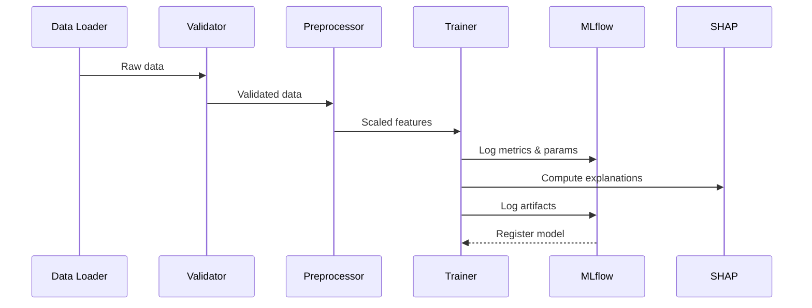
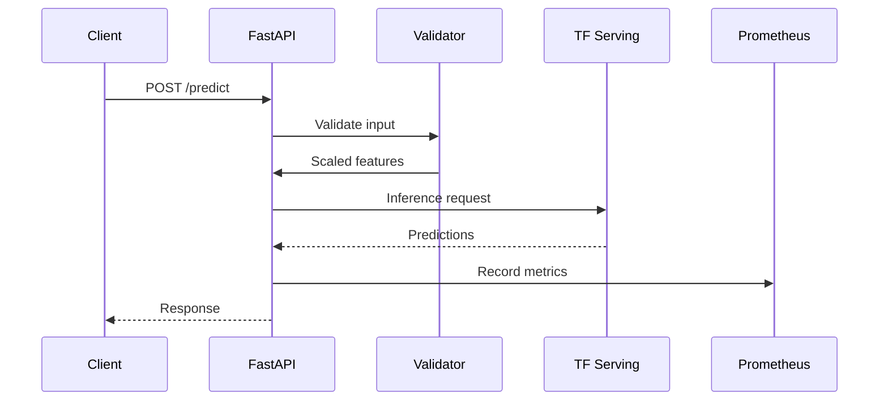

# AutoMLOps Architecture

This document describes the architecture of the AutoMLOps platform.

## System Overview

AutoMLOps is a modular MLOps platform consisting of six main components:

```
┌─────────────────────────────────────────────────────────────────────┐
│                        AutoMLOps Platform                           │
├─────────────┬─────────────┬─────────────┬─────────────┬────────────┤
│  Training   │  Serving    │ Monitoring  │ Pipelines   │  Feature   │
│  Pipeline   │  Layer      │  Stack      │             │  Store     │
└─────────────┴─────────────┴─────────────┴─────────────┴────────────┘
```

## Components

### 1. Training Pipeline (`training/`)

**Purpose:** Data processing, model training, and experiment tracking.

**Modules:**
- `data_loader.py` — Downloads/loads Credit Card Fraud dataset
- `data_ingestion.py` — Generates or loads data, creates train/val/test splits
- `preprocess.py` — StandardScaler fitting, feature scaling
- `train.py` — TensorFlow model training with MLflow logging
- `evaluate.py` — Model evaluation metrics (AUC, accuracy, precision, recall)
- `explainability.py` — SHAP feature importance analysis
- `validation.py` — Pandera schema validation
- `model_card.py` — Auto-generated model documentation

**Flow:**
```
Data Loader → Validation → Preprocessing → Training → Evaluation → MLflow
                                              ↓
                                         Explainability
```

### 2. Serving Layer (`serving/`)

**Purpose:** Production model serving via REST API.

**Components:**
- `FastAPI` — REST API with Pydantic validation
- `TensorFlow Serving` — High-performance model inference
- `/predict` — Inference endpoint with routing
- `/health` — Health check with TF Serving status
- `/metrics` — Prometheus metrics endpoint
- `/traffic` — Canary traffic control

**Request Flow:**
```
Client → FastAPI → Validation → Scaling → TF Serving → Response
                                    ↓
                              Prometheus Metrics
```

### 3. Monitoring Stack

**Prometheus** — Metrics collection
- Request latency histograms
- Request counters by status/route
- Model version gauges
- Canary traffic percentage

**Grafana** — Visualization
- Pre-configured dashboards
- Latency percentiles (p50, p90, p99)
- Error rates
- Drift metrics

### 4. Drift Detection (`drift/`)

**Purpose:** Detect data drift and trigger retraining.

**Methods:**
- **KS-test** — Kolmogorov-Smirnov statistic per feature
- **PSI** — Population Stability Index

**Thresholds:**
```yaml
monitoring:
  drift_threshold_ks: 0.15
  drift_threshold_psi: 0.25
```

### 5. Pipelines (`pipelines/`)

**Purpose:** Orchestration and automation.

**Scripts:**
- `promote_canary.py` — Promote canary model to production
- `auto_promote.py` — Automatic promotion based on metrics
- `rollback.py` — Rollback to previous model version
- `auto_rollback.py` — Automatic rollback on degradation
- `notify.py` — Discord/Slack notifications
- `traffic.py` — Canary traffic control

### 6. Feature Store (`feature_store/`)

**Purpose:** Feature management (optional).

- Feast integration for feature serving
- Parquet offline store

## Data Flow

### Training Flow



### Inference Flow



## Docker Services

| Service | Port | Purpose |
|---------|------|---------|
| `mlflow` | 5000 | Experiment tracking |
| `tfserving` | 8501 | Model serving (gRPC: 8500) |
| `api` | 8000 | FastAPI inference |
| `prometheus` | 9090 | Metrics collection |
| `grafana` | 3000 | Dashboards |
| `trainer` | — | Training container |
| `monitor` | — | Drift detection |

## Configuration

### Environment Variables

| Variable | Default | Description |
|----------|---------|-------------|
| `MLFLOW_TRACKING_URI` | `http://mlflow:5000` | MLflow server |
| `TF_SERVING_URL_PRIMARY` | `http://tfserving:8501/...` | Primary model |
| `TF_SERVING_URL_CANARY` | — | Canary model (optional) |
| `CANARY_ENABLED` | `false` | Enable canary routing |
| `CANARY_PERCENT` | `0` | Traffic to canary (0-100) |

### params.yaml

```yaml
data:
  source: real  # or "synthetic"

experiment:
  name: e2e_mlops
  model_name: model

training:
  epochs: 20
  batch_size: 64
  hidden_units: [128, 64, 32]
  dropout: 0.2
```

## Security Considerations

- No secrets in code (use `.env`)
- Input validation on all endpoints
- Rate limiting (optional)
- TLS for production (configure in nginx)
